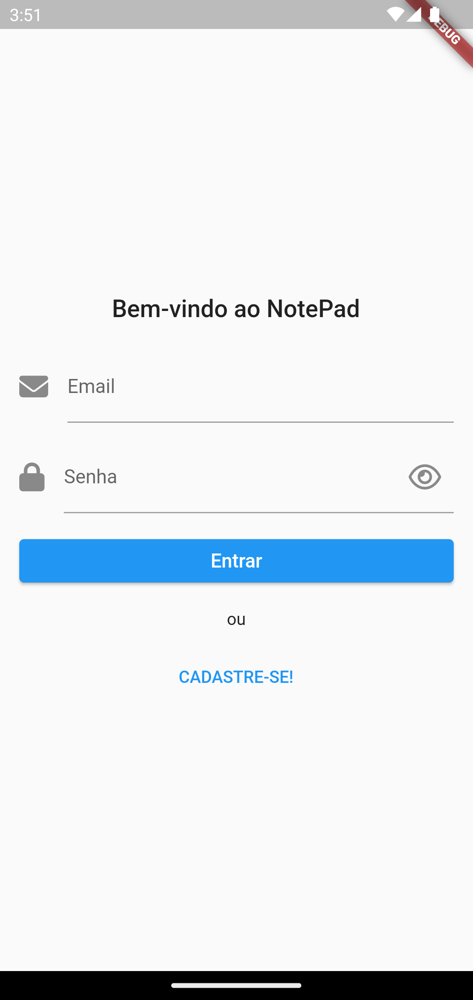

# Simple NotePad

Um bloco de notas em nuvem para você poder armazenar suas informações de forma prática, rápida e segura, podendo acessar seus dados de qualquer lugar e com qualquer device.

## Desenvolvimento

Este aplicativo foi desenvolvido com a tecnologia Flutter integrado com o Firebase.

Estamos utilizando:

- FirebaseAuth para gestão de usuários
- CloudStore para armazenamento dos dados do aplicativo

## Testando o App

É simples, basta você instar seu aplicativo e criar sua conta, assim terá acesso ao ambiente interno do APP, permitindo criar, editar e excluir suas notas, veja como:

Quando o aplicativo abrir, você poderá fazer login diretamente na tela inicial, caso não tenha cadastro, logo abaixo terá uma opção: "CADASTRE-SE", clique e será redirecionado para efetuar o cadastro.

### Primeiros Passos

| Login:                                                         | Cadastro:                                                      |
| -------------------------------------------------------------- | -------------------------------------------------------------- |
| Nesta tela, você poderá preencher seus dados para autenticação | Nesta tela, você deverá cadatrar seus dados para ter uma conta |
| 

     | 

  |

### Usabilidade do App

| Área de trabalho                                                                                                                                             | Listagem e ações                                                                                                                                 |
| ------------------------------------------------------------------------------------------------------------------------------------------------------------ | ------------------------------------------------------------------------------------------------------------------------------------------------ |
| Esta é sua área de trabalho vazia, você poderá sair do app clicando no ícone na barra superior ou criar uma nova nova clicando no menu (+) na barra inferior | Esta área temos 2 notas cadastradas, caso queira visualiza-la, para editar, basta clicar em cima da linha, ou puxe para esquerda para exclui-la. |
| 

                                                                                                    | 

                                                                                  |

| Editando o título                                                                                                                                                       | Editando a nota                                                                                                                                                              |
| ----------------------------------------------------------------------------------------------------------------------------------------------------------------------- | ---------------------------------------------------------------------------------------------------------------------------------------------------------------------------- |
| Quando estiver criando ou editando uma nota, você pode renomear sua nota clicando em cima do título que esta na barra de cima do App, abrinco um campo para você editar | Quando quiser mexer no conteúdo da sua tela em sí, basta clicar em qualquer parte da área branca que irá abrir a caixa de texto para você escrever o quanto achar necessário |
| 

                                                                                                        | 

                                                                                                              |

### Rodando o Aplicativo Localmente

Para rodar o aplicativo, basta você baixa-lo em sua máquina e ter o ambiente do Flutter devidamente configurado, vale lembrar que deixamos nossas credenciais do Firebase disponíveis para que possa testar, pedimos conciência no uso

Agradecimentos,

Marcelo Mussi, Flávio Caruso, Marinaldo Ferrera e Tiago Vaz
